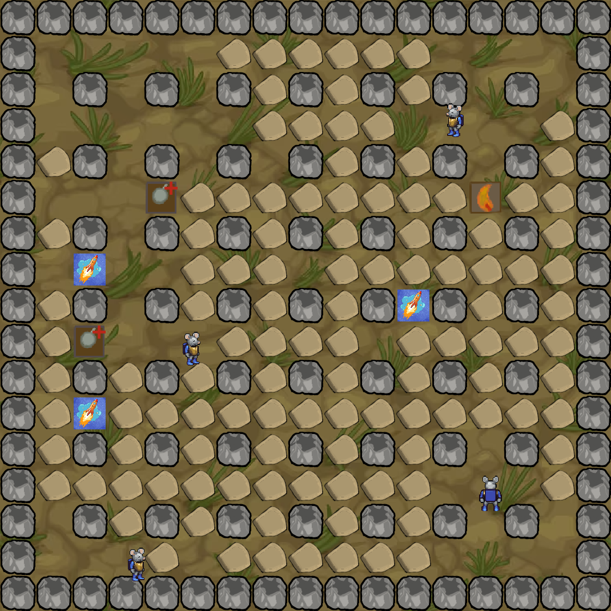

## Steuerung

| Spieler | Bewegung | Bombe |
| --- | --- | --- |
| 1 | W A S D | Q |
| 2 | Pfeiltasten | Strg rechts |
| 3 | I J K L | U |
| 4 | Numpad 8 4 5 6 | Numpad 7 |

## Umgesetzt

- Vier Spieler gleichzeitig über eine Tastatur, unabhängige Eingabeverarbeitung
- Zufällige Verteilung der zerstörbaren Blöcke bei jedem Rundenstart
- Rundensystem mit Punktezählung bis zu drei Siegen
- Bombenlogik mit Zündzeit, Explosionsreichweite und Kettenreaktion auf Blöcke
- Power-ups mit begrenzter Wirkdauer und regelmäßigem Erscheinen
- Kollisionserkennung gegen zerstörbare und unzerstörbare Blöcke
- Klassenstruktur für Spielobjekte, Layer-System für die Zeichenreihenfolge
- Zentrale Konfigurationsdatei für alle Spielparameter

## Grafiken

Das Spielfeld und die Umgebungsgrafiken habe ich selbst erstellt.
Die Spielfiguren stammen aus dem
[Universal LPC Spritesheet Character Generator](https://liberatedpixelcup.github.io/Universal-LPC-Spritesheet-Character-Generator).
Die Nennung der jeweiligen Urheber und Lizenzen findet sich in [CREDITS.txt](CREDITS.txt).
Bomben- und Explosionsgrafiken sind derzeit Platzhalter und werden noch ersetzt.

## Geplant

- Startmenü mit Auswahl der Spielerzahl
- Eigene Bomben- und Explosionsgrafiken
- Mehrere Spielfelder mit unterschiedlichen Themen, zufällig ausgewählt

## Screenshot

